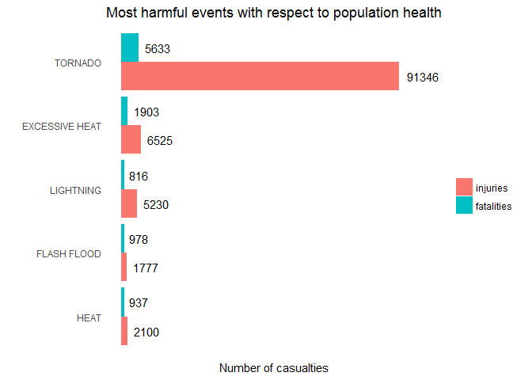
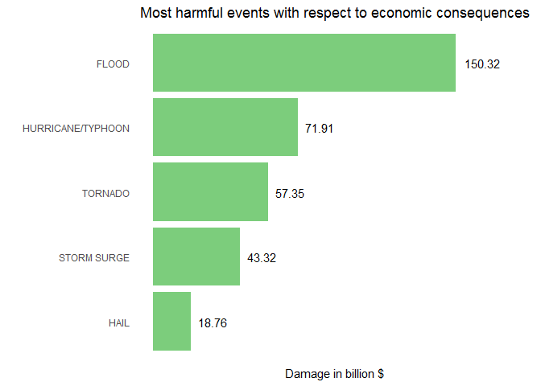

# Most harmful and dangerous weather events across USA
omikad  
April 17, 2016  

# Synopsys

In this report we aim to show severe weather events, most harmful with respect to population health and events that have the greatest economic consequences. Using this report, the one, who might be responsible for preparing for severe weather events, can find information useful for prioritizing resources for different types of events. Hovewer, there are no specific recommendations in this report.

# Data Processing

In this report we start from the raw CSV file containing the data.

At first we include required libraries


```r
library(R.utils)
library(dplyr)
library(data.table)
library(ggplot2)
library(reshape2)
```

Then we read dataset from CSV zipped file. To reduce memory consumption, we select only useful columns, and filter out rows that don't contain useful information.


```r
if (!file.exists("repdata-data-StormData.csv")){
  bunzip2("repdata-data-StormData.csv.bz2", remove = FALSE)
}

data <- data.table::fread("repdata-data-StormData.csv", data.table = FALSE)

data <- data %>% 
  select(EVTYPE,FATALITIES,INJURIES,PROPDMG,PROPDMGEXP,CROPDMG,CROPDMGEXP) %>%
  filter(FATALITIES>0 | INJURIES>0 | PROPDMG>0 | CROPDMG>0) 
```

After reading we check the first few rows in dataset and show dimensions


```r
dim(data)
```

```
## [1] 254633      7
```

```r
head(data)
```

```
##    EVTYPE FATALITIES INJURIES PROPDMG PROPDMGEXP CROPDMG CROPDMGEXP
## 1 TORNADO          0       15    25.0          K       0           
## 2 TORNADO          0        0     2.5          K       0           
## 3 TORNADO          0        2    25.0          K       0           
## 4 TORNADO          0        2     2.5          K       0           
## 5 TORNADO          0        2     2.5          K       0           
## 6 TORNADO          0        6     2.5          K       0
```

To help our research, we need to make data tidy. In this dataset, economic damage is written in 4 columns. Two columns for crop damage, and two columns for property damage. Each pair of columns has value of damage and exponent part. We will decode that into one column that will contain clear absolute damage value.


```r
calc_exp <- function(sym) {
  sym <- ifelse(sym %in% c("H", "h"), 100, sym)
  sym <- ifelse(sym %in% c("K", "k"), 1000, sym)
  sym <- ifelse(sym %in% c("M", "m"), 1e6, sym)
  sym <- ifelse(sym == "B", 1e9, sym)
  sym <- ifelse(sym %in% c("+", "0", "1", "2", "3"), 1, sym)
  sym <- ifelse(sym %in% c("4", "5", "6", "7", "8"), 1, sym)
  sym <- ifelse(sym %in% c("-", "", "?"), 0, sym)
  sym
}

data <- data %>% mutate(PROPDMG = PROPDMG * as.numeric(calc_exp(PROPDMGEXP)))
data <- data %>% mutate(CROPDMG = CROPDMG * as.numeric(calc_exp(CROPDMGEXP)))

head(data)
```

```
##    EVTYPE FATALITIES INJURIES PROPDMG PROPDMGEXP CROPDMG CROPDMGEXP
## 1 TORNADO          0       15   25000          K       0           
## 2 TORNADO          0        0    2500          K       0           
## 3 TORNADO          0        2   25000          K       0           
## 4 TORNADO          0        2    2500          K       0           
## 5 TORNADO          0        2    2500          K       0           
## 6 TORNADO          0        6    2500          K       0
```

# Results

## Harmful events with respect to population health

We group our dataset by weather event type. In each group we find sum of injuries and fatalities. We show top 5 most harmful weather events by using these two features.


```r
harm <- data %>% group_by(EVTYPE) %>% 
  summarize(injuries=sum(INJURIES), fatalities=sum(FATALITIES)) %>%
  arrange(desc(injuries + 10 * fatalities)) %>% top_n(5)

# make plot to be ordered by damage, reverse order
harm$EVTYPE <- factor(harm$EVTYPE, levels=rev(harm$EVTYPE))

# melt harm table to show both features in one plot
harm <- melt(harm, id.vars=c("EVTYPE"))

ggplot(harm, aes(EVTYPE, value, fill=as.factor(harm$variable))) + 
  geom_bar(stat="identity", position="dodge") + 
  geom_text(aes(label=value), position=position_dodge(width=0.9), hjust=-0.25) +
  ylim(c(0, max(harm$value) * 1.1)) +
  xlab("") + ylab("Number of casualties") +
  ggtitle("Most harmful events with respect to population health") +
  guides(fill=guide_legend(title="")) +
  coord_flip() +
  theme(panel.background=element_blank(), axis.text.x=element_blank(),
        axis.ticks.x=element_blank(), axis.ticks.y=element_blank())
```



## Weather events that have the greatest economic consequences

We group our dataset by weather event type. In each group we find sum of property damage and crop damage values. We show top 5 most harmful weather events by using these two features.


```r
economy <- data %>% group_by(EVTYPE) %>% 
  summarize(damage=round(sum(CROPDMG + PROPDMG) / 1e9, digits=2)) %>%
  arrange(desc(damage)) %>% top_n(5)

# make plot to be ordered by damage, reverse order
economy$EVTYPE <- factor(economy$EVTYPE, levels=rev(economy$EVTYPE))

ggplot(economy, aes(EVTYPE, damage)) + 
  geom_bar(stat="identity", position="dodge", fill="palegreen3") + 
  geom_text(aes(label=damage), hjust=-0.25) +
  ylim(c(0, max(economy$damage) * 1.2)) +
  xlab("") + ylab("Damage in billion $") +
  ggtitle("Most harmful events with respect to economic consequences") +
  guides(fill=guide_legend(title="")) +
  coord_flip() +
  theme(panel.background=element_blank(), axis.text.x=element_blank(),
        axis.ticks.x=element_blank(), axis.ticks.y=element_blank())
```



## Conclusion
We can see, for population health, tornado is by far the most dangerous weather event, both for fatalities and injuries casualties. For economic consequences, flood is the most dangerous event. It has double more damage than second - hurricane / typhoon.


.
