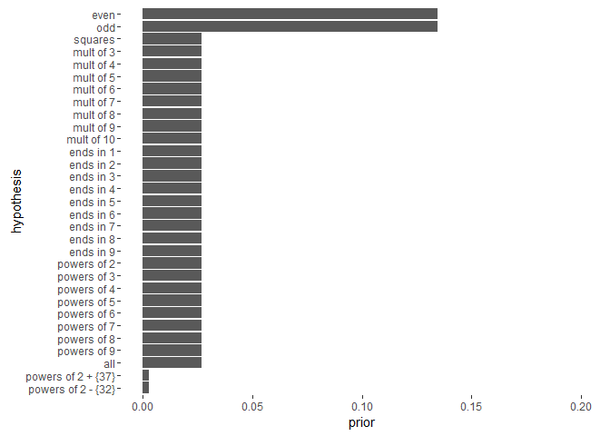
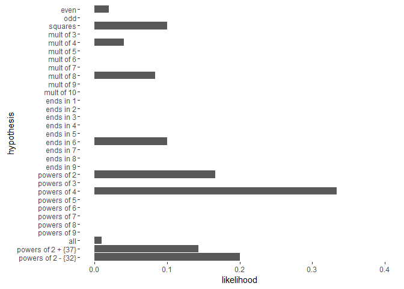
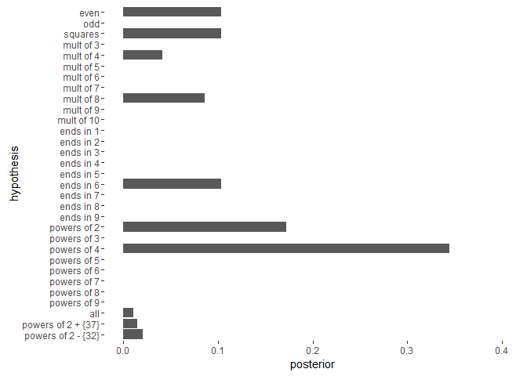
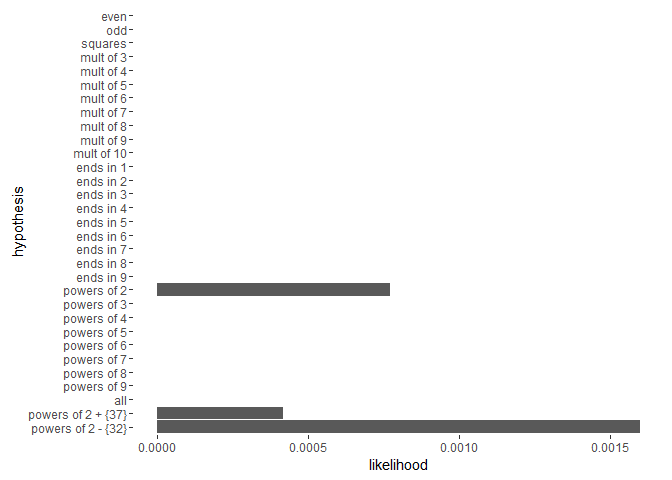
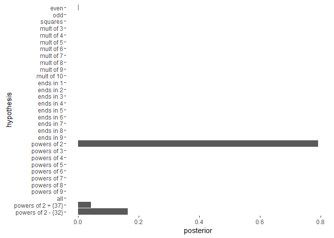

# Bayesian Concept Learning
omikad  
April 4, 2016  


```
## Warning: package 'ggplot2' was built under R version 3.2.3
```

```
## Warning: package 'knitr' was built under R version 3.2.4
```

Hypothesis data consists of the following colummns:

- hypothesis: name of hypothesys

- prior.score: subjective value for hypotheseses. Lower value for "conceptually unnatural" prior

- prior: weighted prior.score

- expression: R expression to generate hypothesis values

- size: number of elements in hypothesis set


```
##            hypothesis prior.score              expression       prior size
## 1                even          50            seq(2,100,2) 0.134408602   50
## 2                 odd          50            seq(1,100,2) 0.134408602   50
## 3             squares          10             seq(1,10)^2 0.026881720   10
## 4           mult of 3          10            seq(3,100,3) 0.026881720   33
## 5           mult of 4          10            seq(4,100,4) 0.026881720   25
## 6           mult of 5          10            seq(5,100,5) 0.026881720   20
## 7           mult of 6          10            seq(6,100,6) 0.026881720   16
## 8           mult of 7          10            seq(7,100,7) 0.026881720   14
## 9           mult of 8          10            seq(8,100,8) 0.026881720   12
## 10          mult of 9          10            seq(9,100,9) 0.026881720   11
## 11         mult of 10          10          seq(10,100,10) 0.026881720   10
## 12          ends in 1          10        seq(0,90,10) + 1 0.026881720   10
## 13          ends in 2          10        seq(0,90,10) + 2 0.026881720   10
## 14          ends in 3          10        seq(0,90,10) + 3 0.026881720   10
## 15          ends in 4          10        seq(0,90,10) + 4 0.026881720   10
## 16          ends in 5          10        seq(0,90,10) + 5 0.026881720   10
## 17          ends in 6          10        seq(0,90,10) + 6 0.026881720   10
## 18          ends in 7          10        seq(0,90,10) + 7 0.026881720   10
## 19          ends in 8          10        seq(0,90,10) + 8 0.026881720   10
## 20          ends in 9          10        seq(0,90,10) + 9 0.026881720   10
## 21        powers of 2          10              2^seq(1,6) 0.026881720    6
## 22        powers of 3          10              3^seq(1,4) 0.026881720    4
## 23        powers of 4          10              4^seq(1,3) 0.026881720    3
## 24        powers of 5          10              5^seq(1,2) 0.026881720    2
## 25        powers of 6          10              6^seq(1,2) 0.026881720    2
## 26        powers of 7          10              7^seq(1,2) 0.026881720    2
## 27        powers of 8          10              8^seq(1,2) 0.026881720    2
## 28        powers of 9          10              9^seq(1,2) 0.026881720    2
## 29                all          10              seq(1,100) 0.026881720  100
## 30 powers of 2 + {37}           1        c(2^seq(1,6),37) 0.002688172    7
## 31 powers of 2 - {32}           1 setdiff(2^seq(1,6), 32) 0.002688172    5
```

Priors:



After observation of {16} we get likelihood:



And posterior:




After observation of {16,8,2,64} we get likelihood:



And posterior:


